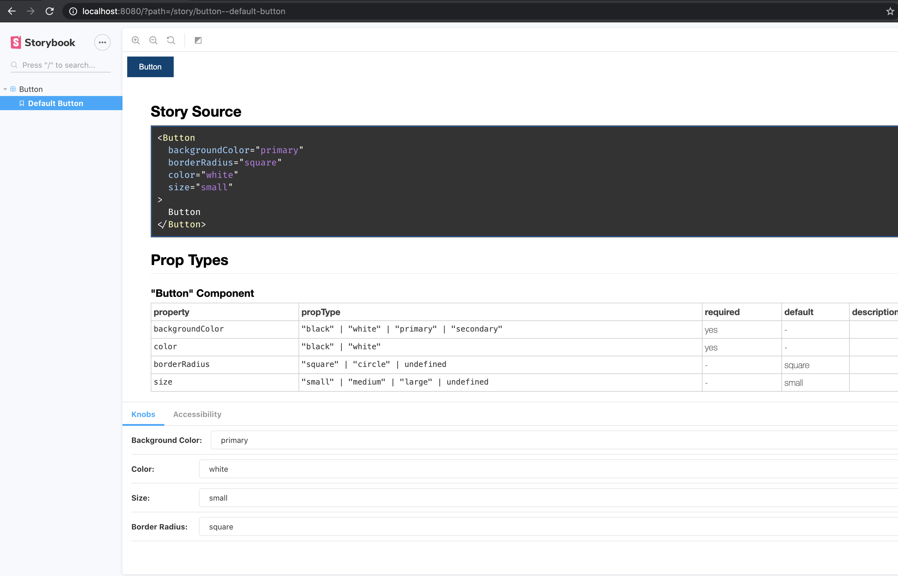

# create-react-styled-library

> Inspired and forked from [create-react-library](https://github.com/transitive-bullshit/create-react-library)

[](https://www.npmjs.com/package/{{name}}) [](https://standardjs.com)

## Intro


This CLI will easily allow you to bootstrap a component library using [styled-components](https://styled-components.com/)

## Features

- Creates a commonjs and es module bundles.
- Rollup for Bundling
- Babel for Transpiling
- Jest for Testing
- Github Pages for showcasing
- Storybook for documentation
- Supports complicated peer-dependencies
- ThemeProvider template
- Optional TypeScript template
- Sourcemap creation

## Usage with npx (recommended)

```sh
$ npx create-react-styled-library
```

## Install globally

```sh
$ npm install -g create-react-styled-library
```

## Getting started

After installing your component library, run

```
$ npm start
```

This will start a storybook dev server with hot reloading for development



To build the bundle, run

```sh
$ npm run build
```

This command will look at your `index.js` or `index.ts` and will create a bundle based on whatever is exported in that file.

**Note**

> If your dependency tree contains any modules imports that are not listed in the peerDependencies in the package.json file, then it will be bundled up in the cjs or esm bundle. styled-components by default will not be bundled since its a peerDependencie, to change that just remove it from the package.json

## License

MIT

## Acknowledgments

Most of the projects code was built from [create-react-library](https://github.com/transitive-bullshit/create-react-library) repo.
